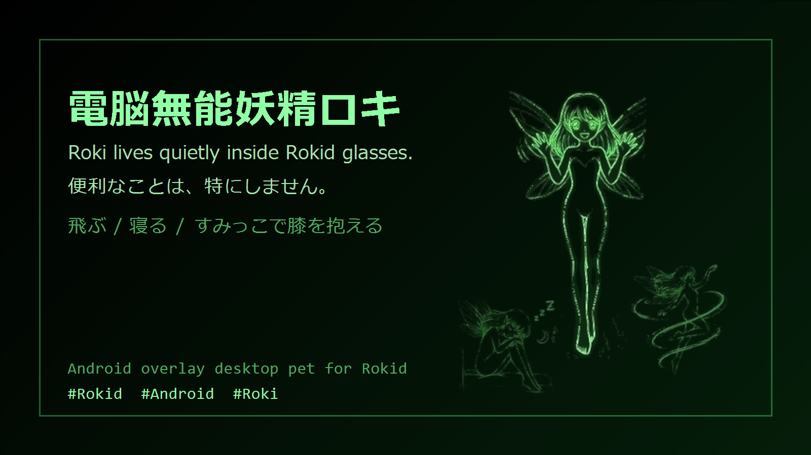

# 電脳無能妖精ロキ / Roki

Roki is a tiny desktop companion for Rokid glasses.

便利なことは、特にしません。  
Rokidグラスの中に住んで、飛んだり、寝たり、膝を抱えたりするだけの「電脳無能妖精」です。



## Features

- Rokidグラス上に小さな妖精を常駐表示
- 他アプリの上に表示するAndroidオーバーレイ方式
- メニューや他アプリの操作を邪魔しにくい小型Window
- ランダム行動: 飛行、上昇、下降、左右移動、踊り、手振り、膝抱え、睡眠
- 飛行中は速度がゆるく変化し、次の行動前に減速
- 睡眠時は画面のすみっこへ移動
- Rokid本体の輝度設定に追従
- ランチャーアイコンもRoki画像

## Current Behavior

Roki starts from the launcher and immediately closes its setup screen, leaving only the overlay fairy.

Launching Roki again works as a simple toggle:

- Roki is sleeping/off: starts the overlay
- Roki is running: stops the overlay

## Install

Install the debug APK on Rokid glasses:

```powershell
adb install -r Roki-v0.1.8-debug.apk
```

Then allow "Display over other apps" for Roki if Android asks for overlay permission.

## Build

This project is a minimal Android Java app.

```powershell
$env:JAVA_HOME='C:\Program Files\Android\Android Studio\jbr'
$env:PATH="$env:JAVA_HOME\bin;$env:PATH"
gradle assembleDebug
```

The generated APK is:

```text
app/build/outputs/apk/debug/app-debug.apk
```

## Notes

- This is an experimental pet app for Rokid glasses.
- Some Rokid system gestures may temporarily hide application overlays. Roki tries to reattach its small overlay window after menu-close/system-dialog events.
- This app does not intentionally control display brightness.

## License

License is not decided yet.

Until a license is added, the source code and image assets are published for viewing only. Do not redistribute or reuse them without permission from the project owner.
